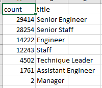
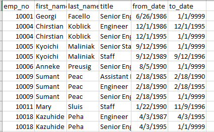
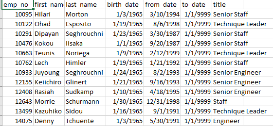

# Pewlett-Hackard-Analysis
## Overview
The purpose of this project was to help the HR manager at "Pewlett Hackard" prepare for the "silver tsunami". The research is specifically geared towards helping the company determine employee eligibility for a mentorship program.
## Results
-At least two out of every three employees who are retiring from staff or engineering roles have reached senior-level. 

-Many retiring employees were promoted from lower positions to their current positions.

-Not all employees listed as nearing retirement are currently employed by "Pewlett Hackard".

-Many mentorship-eligible employees have reached senior-level.

## Summary
Up to 90,398 roles will need to be filled thanks to the "Silver Tsunami". There are not enough mentorship-eligible employees to mentor the next generation of employees. Since many employees with senior-level roles are nearing retirement, a query to select employee numbers, names, titles, from_date and to_date from a join of the employees table and titles table into a new table could lend more insight into candidacy for a promotion. Assuming the set is filtered to include only current employees, the analyst would use a DISTINCT ON statement to get employees' current titles. The analyst would then filter by from_date to find which employees have been in their current position the longest.

Another query that would be helpful would be selection of employee numbers, names and departments from a join of the department employees table, department managers table and departments table to find other departments in which managers have experience.  